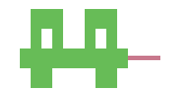
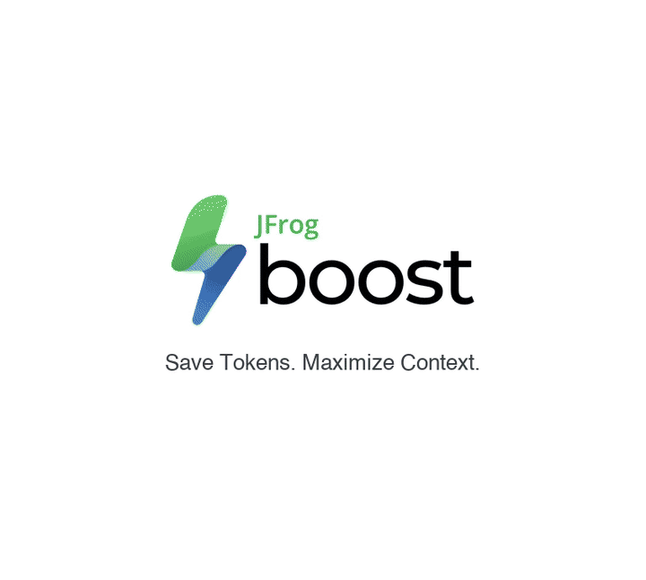

<p align="center">
  <a href="https://boost.jfrog.com/">
    <picture>
      <source srcset=".github/assets/boost-logo-dark.png" media="(prefers-color-scheme: dark)">
      <source srcset=".github/assets/boost-logo-light.png" media="(prefers-color-scheme: light)">
      
    </picture>
  </a>
</p>

<p align="center">
  <strong>Save tokens. Maximize context.</strong>
</p>

<p align="center">
  <sub>Smart token savings for coding agents and shell commands.</sub>
</p>

<p align="center">
  <a href="https://boost.jfrog.com/"><img src="https://img.shields.io/badge/website-boost.jfrog.com-36a13b?logo=data%3Aimage%2Fsvg%2Bxml%3Bbase64%2CPHN2ZyB3aWR0aD0iODciIGhlaWdodD0iMTUyIiB2aWV3Qm94PSIwIDAgODcgMTUyIiBmaWxsPSJub25lIiB4bWxucz0iaHR0cDovL3d3dy53My5vcmcvMjAwMC9zdmciPgo8cGF0aCBmaWxsLXJ1bGU9ImV2ZW5vZGQiIGNsaXAtcnVsZT0iZXZlbm9kZCIgZD0iTTUyLjA3NDcgNDYuNTA3OUM1Mi4yNDIxIDQ2LjMyMTYgNTIuMTkzMiA0Ni40MTIzIDUyLjM1NDQgNDYuMTE1Mkw1NC43MjM1IDM5LjM0MzhDNTUuMTQzNyAzOC4wNjM5IDU3LjA4NzggMzIuNjgwOCA1Ny4wMzYxIDMxLjkzMDNDNTcuMjk2MiAzMS42ODA3IDU3LjEyNjMgMzEuODk0OSA1Ny4zMzAxIDMxLjU1MzVDNTcuMzM4NCAzMS41Mzk1IDU3LjUwODkgMzEuMTk1MyA1Ny41MjM0IDMxLjE2MDFDNTcuNjIyMiAzMC45MjI4IDU3LjcxMzQgMzAuNTkzNiA1Ny43OTEyIDMwLjM0N0M1Ny45NzU0IDI5Ljc2MDcgNTguMTI0MSAyOS4yNTUxIDU4LjMzMzYgMjguNjg3M0M2MC4yMTIzIDIzLjU5NTQgNjIuMzY3OSAxNi42ODE3IDY0LjIxMzkgMTEuMjk4OUM2NS4xMTQ2IDguNjcyMjMgNjQuOTA5IDUuODU0NTIgNjMuNTQyIDMuNjc5NzVDNjAuNjA4MiAtMC45ODczNzcgNTMuNzk0NiAtMC4xNDgxNDcgNDkuMDYzOCAwLjUzODI0OUMzNC44OTQ0IDIuNTk0MTMgMjQuMjEyOSAxMi4wODU0IDE4LjUzNTggMjUuNDg1OUMxNy4xNDQyIDI4Ljc3MDggMTUuMTQxMyAzNS41NTIxIDEzLjc0OTEgMzkuMjg1M0w5LjAyNzYxIDUzLjMyMTVDOC40NjUxMiA1NC42MjUgNy44NTcwNiA1Ni41NjQ0IDcuNDM0NTMgNTcuODUyMkM2Ljg2OTgxIDU5LjU3MzYgNi4zMzYxNSA2MC45NDYgNS43NjUyOSA2Mi43MDRDNC42ODk1OSA2Ni4wMTcgMy41NDUxNCA2OS4wNjcyIDIuNDI5NzUgNzIuNDkyM0MxLjY4ODMyIDc1LjQxODQgLTAuNTI0NjM2IDc5LjA4MzMgMC4xMTQ0MTMgODIuNDA0OUMwLjQ0MDQzNiA4NC4wOTkgMS4zOTMxNSA4NS42NDI1IDIuMzAzODYgODYuNTIzM0MyLjk2OTY5IDg3LjE2NjkgNC45NjkxOSA4OC43MjY1IDYuNDUzNDUgODguNjE1M0M2LjcxMTM0IDg4LjgyNTIgNi40MDg4MSA4OC42ODY1IDYuODQ4OTQgODguODE3N0w4Ljg0Mjg5IDg4LjkzMjJDOS43NDQ4NCA4OC45MTQ1IDEwLjY0MDQgODguODg3OCAxMS41NDI4IDg4Ljg5OTVDMTEuNTg2NSA4OC44NjU2IDExLjY2MDEgODguNzcxOSAxMS42ODQzIDg4LjgxMjlMMTIuMzE2MyA4OC40MzgzQzEzLjM4NjkgODcuODM4NCAxMy4xMDQzIDg4LjMgMTQuNzIzOSA4Ny41MDczQzE1LjI2NTUgODcuMjQyMSAxNS43NDIgODcuMDcwNyAxNi4yNDQ5IDg2LjgwODVDMTkuNjI3OCA4NS4wNDQzIDIzLjAzMzQgODIuMTgwNiAyNS42NzM4IDc5LjU2NzJMMjkuNDA1NCA3NS41MzM0QzI5Ljc0MzUgNzUuMDQ4IDI5LjM0MDMgNzUuMzg3OCAyOS44NzU5IDc0Ljg1MjNDMzEuNzE1OSA3My4wMTE0IDMwLjYyMTcgNzMuOTczOCAzMS4zNTc3IDcyLjk3MDRDMzEuNTc5OSA3Mi4xNzQxIDMyLjAyMDMgNzEuOTU2MSAzMi40Nzg5IDcxLjMyNjRDMzIuODc0NiA3MC43ODMyIDMzLjI0NDQgNzAuMzI1MSAzMy42NTAxIDY5LjkxMzlDMzQuMTE4OSA2OS40MzgzIDM1LjY5OTYgNjcuNjUxOCAzNS43MzU0IDY3LjIwNzhDMzYuNTI0IDY3LjIyNTMgMzYuODk2MSA2Ni4zNTE2IDM3LjM4MzUgNjUuODQyN0MzNy45OTg1IDY1LjE5OTkgMzguNDk0NSA2NC43OTEyIDM5LjEyNzYgNjQuMjUwN0w0MC41NzU1IDYzLjI5OTlDNDEuMzIwMiA2Mi45NTc2IDQwLjM3MTEgNjMuNzMyNiA0MC45MDUgNjMuMDIzNEw0MS43NDIzIDYyLjIyOTNDNDMuNzg2NyA2MC43ODM4IDQ3LjA2NDEgNTkuMTQyNiA0OS41MTY4IDU4LjUyMDJDNTAuMjc2MSA1OC4zMjc0IDUxLjcxNjcgNTguMTA2MyA1Mi40OTUzIDU3Ljk5OTJMNTMuOTU3OCA1Ny43NDMxQzUzLjI1NDggNTcuNTM1NyA1NC4wMDI5IDU3LjgyNSA1My42NTkgNTcuNDQ1MkM1MS44NzM1IDU2LjgzNDcgNTAuNDI2OCA1NS4wOTk4IDUwLjQ2NzYgNTIuNzYzMUM1MC41MDY5IDUwLjUyNTUgNTIuMjIyNCA0Ny43ODIgNTIuMDc0NyA0Ni41MDc5WiIgZmlsbD0idXJsKCNwYWludDBfbGluZWFyXzE2MF81KSIvPgo8cGF0aCBmaWxsLXJ1bGU9ImV2ZW5vZGQiIGNsaXAtcnVsZT0iZXZlbm9kZCIgZD0iTTY5Ljg4NzEgOTQuMzYwNUw4MS41NTI5IDc2LjIyNzVDODMuMDgxNCA3My43NjAzIDg2LjM4NzIgNjkuNjUwNSA4Ni42NjE2IDY2LjUyODRDODcuMDYwNiA2MS45OTIzIDg0LjAxMDggNTguNTkyMiA4MC4zMDg4IDU3Ljg1MDhDNzUuODQwNiA1Ny41ODM4IDczLjYzMjQgNTguNDU3NyA3MC4yNzg2IDYwLjA1NDRDNjcuMzI2NSA2MS40NTk5IDY1LjQ1NjQgNjMuMjAyIDYzLjM3MjkgNjUuMDEyOUM2MS4xNTg5IDY2LjkzNzMgNTkuMzY2MyA2OS4wMDgxIDU3LjUzODIgNzEuMjQwNkM1Ni44NDIxIDcyLjA5MTIgNTIuNDA2MSA3Ny4zMDU1IDUyLjMxMDUgNzcuNzA3TDUxLjczNTYgNzcuOTg3QzUxLjA3NjQgNzkuNDg5NSA0NS44NTkzIDgzLjgyNiA0NC41MDY2IDg0LjcyNzRDNDMuMDM4MiA4NS43MDU4IDQxLjQ1NDcgODYuNTM5MyAzOS45MTc3IDg3LjE5ODVDMzcuNDgyMiA4OC4yNDMyIDM2LjU1OTcgODguMTcwOSAzNC41MjA2IDg4LjYyMTlDMzQuNDQzIDg4Ljk2NjEgMzQuMjQxOCA4OC40ODc0IDM1LjAxNzcgODkuMTI2NkMzNy4wOTU1IDg5LjUwODUgMzguNTkwOCA5MS41NDI5IDM4LjYzNjMgOTMuODk5M0MzOC42Njc1IDk1LjUwODggMzcuNDM2MyA5OS4xOTI3IDM2Ljk1NDYgMTAwLjgxQzM2LjIwNzEgMTAzLjMxOSAzMy4zOTA0IDExMi4zNjEgMzMuMTQzMiAxMTQuMTkzQzMzLjAwOTMgMTE0LjIyOSAzMy4xNDU1IDExNC4wMDMgMzIuOTU2NSAxMTQuNDUxQzMyLjE5NzggMTE2LjI1MSAyNC4xNzUgMTQ0Ljg0MyAyNC4xMzE4IDE0NS4yNzRDMjMuNDkxIDE1MS42NTMgMzAuODM0MyAxNTQuNjUyIDM0Ljc5MzMgMTQ5LjA1MkMzNy41NDA2IDE0NS4xNjUgNTMuMTQ3MyAxMjAuNDE3IDUzLjE4NzUgMTIwLjE4OEM1My4zNjc3IDEyMC4wMzUgNTMuMzI4MiAxMjAuMDc1IDUzLjUwNzggMTE5Ljg3Nkw2NS43Mzk3IDEwMC45MDFDNjYuMzc3OCA5OS44NDM0IDY3LjE2NTIgOTguNzg0IDY3Ljc5MTYgOTcuNzUxNkM2OC40MjA3IDk2LjcxNDkgNjkuNDI2NiA5NS4zNzIzIDY5Ljg4NzEgOTQuMzYwNVoiIGZpbGw9InVybCgjcGFpbnQxX2xpbmVhcl8xNjBfNSkiLz4KPHBhdGggZmlsbC1ydWxlPSJldmVub2RkIiBjbGlwLXJ1bGU9ImV2ZW5vZGQiIGQ9Ik0zMS4zNTc0IDcyLjk2OTlDMzAuNjIxNyA3My45NzM2IDMxLjcxNTkgNzMuMDExMiAyOS44NzU3IDc0Ljg1MkMyOS4zNDAzIDc1LjM4NzYgMjkuNzQzNSA3NS4wNDc2IDI5LjQwNTQgNzUuNTMzMUwyNS42NzM4IDc5LjU2NjhDMjMuMDMzNCA4Mi4xODAyIDE5LjYyNzcgODUuMDQ0MSAxNi4yNDQ4IDg2LjgwODFDMTUuNzQxOSA4Ny4wNzA1IDE1LjI2NTQgODcuMjQxNiAxNC43MjM4IDg3LjUwNjlDMTMuMTA0MyA4OC4yOTk2IDEzLjM4NjggODcuODM4IDEyLjMxNjIgODguNDM4MUwxMS42ODQzIDg4LjgxMjdDMTEuNjYgODguNzcxNiAxMS41ODY1IDg4Ljg2NTEgMTEuNTQyOCA4OC44OTkxQzE1LjUwNjUgODguOTUzNCAxOS40ODk0IDg4Ljg4NyAyMy40NTU5IDg4LjkwMzlDMjYuNjUwMiA4OC45MTc2IDMyLjE3MjIgODguNTk4MiAzNS4wMTc3IDg5LjEyNjRDMzQuMjQxOCA4OC40ODcyIDM0LjQ0MjggODguOTY1OSAzNC41MjA2IDg4LjYyMTdDMzYuNTU5NyA4OC4xNzA5IDM3LjQ4MjIgODguMjQzIDM5LjkxNzUgODcuMTk4M0M0MS40NTQ1IDg2LjUzOTEgNDMuMDM4MiA4NS43MDU2IDQ0LjUwNjYgODQuNzI3MUM0NS44NTkxIDgzLjgyNTggNTEuMDc2MiA3OS40ODkzIDUxLjczNTQgNzcuOTg2OEw1Mi4zMTA1IDc3LjcwNjhDNTIuNDA1OSA3Ny4zMDUzIDU2Ljg0MTkgNzIuMDkxIDU3LjUzODIgNzEuMjQwNEM1OS4zNjYzIDY5LjAwNzkgNjEuMTU4OSA2Ni45MzY5IDYzLjM3MjkgNjUuMDEyN0M2NS40NTY0IDYzLjIwMTggNjcuMzI2MyA2MS40NTk3IDcwLjI3ODYgNjAuMDU0MkM3My42MzI0IDU4LjQ1NzUgNzUuODQwNCA1Ny41ODM2IDgwLjMwODggNTcuODUwNkM3OC41NTcxIDU3LjUxNDEgNzYuMDc3IDU3Ljc4ODUgNzQuMTM4IDU3Ljc0MzFDNzIuMDYzNSA1Ny42OTQyIDY5LjkzMiA1Ny43NTc1IDY3Ljg0OSA1Ny43NTU0QzYzLjU5MzcgNTcuNzUwNiA1OS4zNDEyIDU3LjczIDU1LjA4NjkgNTcuNzIzNUw1My42NTkgNTcuNDQ0N0M1NC4wMDI5IDU3LjgyNDMgNTMuMjU0OCA1Ny41MzUzIDUzLjk1NzggNTcuNzQyN0w1Mi40OTUzIDU3Ljk5ODhDNTEuNzE2NyA1OC4xMDU4IDUwLjI3NjEgNTguMzI3IDQ5LjUxNjggNTguNTE5OEM0Ny4wNjQxIDU5LjE0MjIgNDMuNzg2NyA2MC43ODM0IDQxLjc0MjMgNjIuMjI4OEw0MC45MDUgNjMuMDIzQzQwLjM3MTEgNjMuNzMyMiA0MS4zMjAyIDYyLjk1NzIgNDAuNTc1NSA2My4yOTk1TDM5LjEyNzYgNjQuMjUwMkMzOC40OTQ1IDY0Ljc5MDggMzcuOTk4MyA2NS4xOTk1IDM3LjM4MzUgNjUuODQyMUMzNi44OTYxIDY2LjM1MTIgMzYuNTI0IDY3LjIyNDkgMzUuNzM1NCA2Ny4yMDc0QzM1LjY5OTYgNjcuNjUxMyAzNC4xMTg5IDY5LjQzNzkgMzMuNjUwMSA2OS45MTM0QzMzLjI0NDQgNzAuMzI0NyAzMi44NzQ2IDcwLjc4MjggMzIuNDc4OSA3MS4zMjZDMzIuMDIwMyA3MS45NTU3IDMxLjU3OTcgNzIuMTczOSAzMS4zNTc0IDcyLjk2OTlaIiBmaWxsPSJ1cmwoI3BhaW50Ml9saW5lYXJfMTYwXzUpIi8%2BCjxkZWZzPgo8bGluZWFyR3JhZGllbnQgaWQ9InBhaW50MF9saW5lYXJfMTYwXzUiIHgxPSIzMi41MDc4IiB5MT0iNjcuNDY1NiIgeDI9IjM2LjAzMDciIHkyPSIxNC4xMTA1IiBncmFkaWVudFVuaXRzPSJ1c2VyU3BhY2VPblVzZSI%2BCjxzdG9wIHN0b3AtY29sb3I9IiM3MUQyNjYiLz4KPHN0b3Agb2Zmc2V0PSIxIiBzdG9wLWNvbG9yPSIjMDFBMDIwIi8%2BCjwvbGluZWFyR3JhZGllbnQ%2BCjxsaW5lYXJHcmFkaWVudCBpZD0icGFpbnQxX2xpbmVhcl8xNjBfNSIgeDE9IjU1Ljg5OSIgeTE9IjYyLjk5ODgiIHgyPSIzNy44MTAzIiB5Mj0iMTM1Ljk4MSIgZ3JhZGllbnRVbml0cz0idXNlclNwYWNlT25Vc2UiPgo8c3RvcCBzdG9wLWNvbG9yPSIjMjU0MzlFIi8%2BCjxzdG9wIG9mZnNldD0iMSIgc3RvcC1jb2xvcj0iIzA1ODBEMSIvPgo8L2xpbmVhckdyYWRpZW50Pgo8bGluZWFyR3JhZGllbnQgaWQ9InBhaW50Ml9saW5lYXJfMTYwXzUiIHgxPSI1Ny4yMTg0IiB5MT0iNjAuMTAxNCIgeDI9IjM0LjQwODQiIHkyPSI4MS45Mjc1IiBncmFkaWVudFVuaXRzPSJ1c2VyU3BhY2VPblVzZSI%2BCjxzdG9wIHN0b3AtY29sb3I9IiMwNUM4OTQiLz4KPHN0b3Agb2Zmc2V0PSIxIiBzdG9wLWNvbG9yPSIjMUFBOENEIi8%2BCjwvbGluZWFyR3JhZGllbnQ%2BCjwvZGVmcz4KPC9zdmc%2BCg%3D%3D" alt="Website"></a>
  <a href="https://github.com/jfrog/boost/releases"></a>
  <a href="https://go.dev/"></a>
  
  <a href="https://github.com/jfrog/boost/releases"></a>
  <a href="https://github.com/jfrog/boost/stargazers"></a><br>
  
  
</p>

<p align="center">
  <sub>Sponsored by <a href="https://jfrog.com"><strong>JFrog</strong></a></sub>
</p>

---

<p align="center">
  <strong>Frogi, our mascot, appears when you run just <code>boost</code>.</strong>
</p>

<p align="center">
  <picture>
    <source srcset=".github/assets/boost-mascot-dark.png" media="(prefers-color-scheme: dark)">
    <source srcset=".github/assets/boost-mascot-light.png" media="(prefers-color-scheme: light)">
    
  </picture>
</p>

**Boost** wraps the commands your agents already run, turning noisy logs into compact, structured context that keeps the signal — errors, timings, changed counts, cache hits — while cutting the noise.

Boost never trades quality for savings. It trims only what's safe to drop, so agent output stays just as sharp. Our [Terminal-Bench 2.0 benchmark](https://boost.jfrog.com/blog/benchmarks-terminal-bench/) shows it: identical task pass rate, ~12% lower cost — Boost keeps agents optimized without ever breaking their stride.

<p align="center">
  <picture>
    <source srcset=".github/assets/boost-how-to-use-dark.gif" media="(prefers-color-scheme: dark)">
    <source srcset=".github/assets/boost-how-to-use-light.gif" media="(prefers-color-scheme: light)">
    
  </picture>
</p>

## Quick start

**Install Boost**

macOS / Linux / Windows WSL:

```bash
curl -fsSL https://boost.jfrog.com/install.sh | bash
```

Windows PowerShell:

```powershell
irm https://boost.jfrog.com/install.ps1 | iex
```

**Wire it into Cursor, Claude Code, Codex, Gemini CLI, and more:**

```bash
boost init
```

## When to use Boost

- **Long coding-agent sessions** — Keep context lean across dozens of shell commands so agents spend tokens on the task, not scrollback.
- **Noisy test, build, and debug loops** — Compress `npm test`, `pytest`, `go test`, `docker build`, linters, and logs while keeping failures and summaries.
- **CI pipelines** — Shorter, easier-to-scan job logs with timing and cache signal for GitHub Actions and other runners.
- **Custom or internal tools** — Add TOML filters for your own CLIs so the same compression loop covers the tools your agents actually run.

## Smart token savings

Boost does not just truncate output. It applies command-aware filters that preserve what agents need to reason about the result.

```bash
# Without Boost: ~9,800 tokens of install noise
$ npm ci
npm warn deprecated inflight@1.0.6 / rimraf@3.0.2 / glob@7.2.3 …
added 1285 packages, audited 1286 in 45s
found 0 vulnerabilities

# With Boost: ~640 tokens, same outcome, cache-backed
$ boost npm ci
[OK] npm ci · 1,285 packages restored from boost cache in 2.4s · 0 vulnerabilities
```

The agent sees the useful summary, not the scrollback. On failures, Boost keeps the failing test, compiler error, or stack frame that matters.

## [How Boost is different](https://boost.jfrog.com/docs/en/overview/en/why-boost/)

| Capability | Boost | RTK | Headroom | Caveman |
| --- | :---: | :---: | :---: | :---: |
| Command output compression | ✓ | ✓ | ✓ | × |
| Full-context and RAG compression | × | × | ✓ | × |
| Assistant reply compression | × | × | × | ✓ |
| Command output recovery | ✓ | ✓ | ✓ | × |
| Native approval sees original executable | ✓ | × | — | — |
| Versioned retrieval feedback | ✓ | × | × | × |
| Auto-disable repeatedly retrieved filters | ✓ | × | × | × |
| End-to-end agent task + cost A/B | ✓ | × | × | × |

## See your savings

After wrapping commands, check how many tokens Boost kept out of your context window:

```bash
boost report
```

Open an interactive breakdown in your browser:

```bash
boost report -w
```

## What it wraps

- **Agents:** Cursor, Claude Code, GitHub Copilot, Codex CLI, Gemini CLI, Windsurf, Cline.
- **Commands:** Docker, npm, pytest, Git, GitHub CLI, and other shell commands pass through the same wrapper.

## Usage examples

- `boost docker build ...` — compressed build log and layer-cache summary
- `boost npm ci` — dependency summary, local package cache, retry-safe output
- `boost pytest` — quiet output on green runs, useful failures when tests break

## Update

```bash
boost update
```

## Documentation

See the [full documentation](https://boost.jfrog.com/docs/) for commands, configuration, and OpenTelemetry export.

## Security & Privacy

- **Local-first.** Command history and raw logs stay on your machine.
- **Only metadata leaves.** When Boost sends usage data, it goes only to JFrog to help improve the product. Exported metadata includes timing, exit code, and cache stats, never raw logs, file contents, or env values. Secrets matching patterns like `*_TOKEN`, `*_SECRET`, `AWS_*`, `DATABASE_URL` are redacted before write or export.
- **Open protocol, signed binaries.** OpenTelemetry-native. Binaries ship signed via GitHub Releases.

Full policy, supported versions, and how to report a vulnerability: see [SECURITY.md](./SECURITY.md).

## License

Copyright © 2026 JFrog Ltd. All rights reserved. See [LICENSE](LICENSE) and [BETA_AGREEMENT.md](BETA_AGREEMENT.md).

---

*Dedicated to the memory of Dima Gershovich — a brilliant engineer, a talented musician, and a dear friend.* [Read Dima's story](docs/memorial/MEMORIAL.md)
